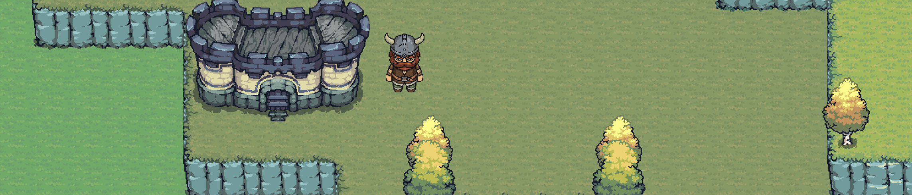

  <h1>Hi there 👋, I'm Carlos</h1>
  

    💻 Software Engineer | 🚀 Ruby on Rails | 🎮 Indie Game Dev in progress  
    Founder of <b>Near</b> — Technology for Entertainment & Audiovisual Experiences 🎬
  

  

---

## 👨‍💻 About me

- 💼 Software Engineer specialized in **Ruby on Rails**
- 📱 Experience building apps with **Kotlin for Android**
- 🎮 Currently exploring the world of **indie game development**
- 🏢 Founder of **Near**, a technology company focused on the **entertainment and audiovisual sector**  
  (games, music, interactive experiences, and digital media)
- 🌱 Always learning and building projects with a long-term vision

---

## 🚀 Tech Stack

**Backend**
- Ruby on Rails  
- PostgreSQL  
- REST APIs  

**Frontend**
- React + TypeScript  
- Next.js  

**Mobile**
- Kotlin  
- Android Development (Jetpack Compose)

**Entertainment & Game Dev (learning)**
- Multiplayer game architecture  
- WebSockets  
- Interactive and real-time systems  

---

🎮 Featured Project – Warriors Arena

  

Warriors Arena is a real-time multiplayer browser game focused on competitive combat and fast-paced action.

🔥 Highlights

⚔️ Real-time multiplayer architecture

🌐 WebSockets-based networking

🧠 Server-authoritative game logic

🎮 Built with Phaser + custom backend

🚀 Live production deployment

👉 Play now: https://warriorsarena.io

---

## 📌 Current Focus

- Building my first indie multiplayer game project  
- Growing **Near** as a platform for entertainment technology  
- Improving my skills in real-time applications, game development, and multimedia experiences  

---

## 📫 Connect with me

- Linkedin: [@carlos](https://www.linkedin.com/in/carlos-andres-acosta-tangarife/)

---

  
Thanks for visiting my profile ⭐

<!--
**carlosacta1/carlosacta1** is a ✨ _special_ ✨ repository because its `README.md` (this file) appears on your GitHub profile.

Here are some ideas to get you started:

- 🔭 I’m currently working on ...
- 🌱 I’m currently learning ...
- 👯 I’m looking to collaborate on ...
- 🤔 I’m looking for help with ...
- 💬 Ask me about ...
- 📫 How to reach me: ...
- 😄 Pronouns: ...
- ⚡ Fun fact: ...
-->
