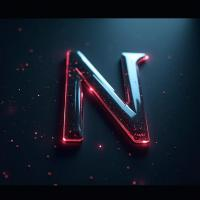

  <h1> 
    Hi there 👋, I'm Carlos
  </h1>

  <h3 align="center">
    Software Engineer • Mechanical Engineer • Technology Founder
  </h3>

  

    Building technology at the intersection of software, robotics, electronics and engineering. 
  

  

---

## 👨‍💻 About me

- 💼 Software Engineer specialized in **Ruby on Rails**
- ⚙️ Mechanical Engineer passionate about engineering and product development
- 🔌 Interested in **Embedded Systems**, **Electronics**, **Automation**, and **Robotics**
- 🏢 Founder of **Near**
- 🌎 Building technology for **Search & Rescue**, **Safety**, and **Defense Applications**
- 🚀 Passionate about creating products that combine software and hardware

---

## 🚀 Tech Stack

### Backend

- Ruby on Rails
- PostgreSQL
- REST APIs
- WebSockets

### Frontend

- React
- TypeScript
- Next.js
- Tailwind CSS

### Mobile

- Kotlin
- Android
- Jetpack Compose

### Engineering

- Embedded Systems
- Mechanical Systems
- IoT - Robotics
- Electronics
- Automation
- Sensor Integration

---

## 📌 Current Focus

- Developing technology for **Near World Solutions**
- Search & Rescue Systems
- Robotics
- Embedded Software
- Industrial Automation
- Mechanical Defense Systems
- Intelligent Sensing
- High-performance Backend Systems

---

## 🌱 Always Learning

I enjoy learning new technologies and solving multidisciplinary engineering challenges, especially those involving software, electronics, embedded systems, and robotics.

---

## 📫 Connect with me

- Linkedin: [@carlos](https://www.linkedin.com/in/carlos-andres-acosta-tangarife/)

---

  
Thanks for visiting my profile ⭐

